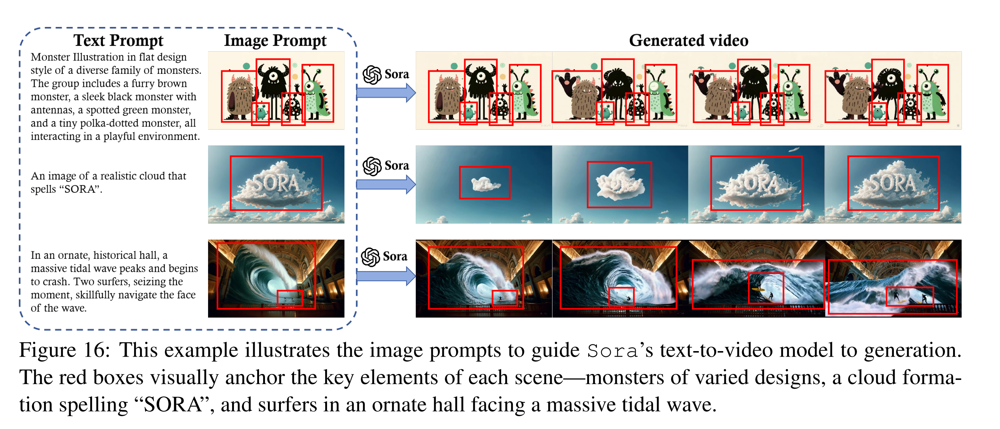
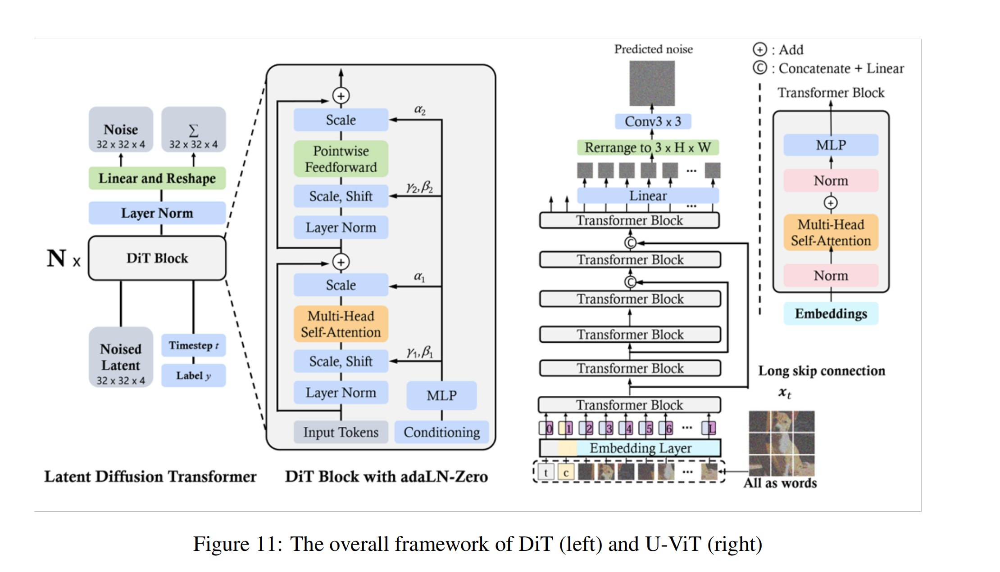

# Video Generation Models as World Simulators (Sora)


Presenter: Kunyang Ji

Date: 2025.11.17

# 1. Overview:

**Context:**

For the past few years, generative AI has mastered text (like GPT) and images (like DALL-E). The natural next frontier has been high-fidelity video. This has demonstrated significant difficulty due to the fundamental obstacle of temporal consistency—ensuring that objects and individuals remain coherent and adhere to the laws of physics over time.

**The Problem:**

How do you build a single, scalable model that can generate high-fidelity video of any duration, any aspect ratio, and any resolution? Existing approaches failed to meet all these criteria:

- Cascaded U-Nets (like Google's Imagen Video): Powerful, but extremely complex. They require a rigid pipeline of 7 or more separate models and are locked into fixed resolutions.

- Autoregressive Transformers (like VideoGPT): Coherent, but extremely slow. They must generate every "token" of video one by one, which is not scalable.
  

**Approach (Sora's Big Bet):**

Sora's approach is to re-frame the entire problem. Instead of just "making videos," the goal is to create a "world simulator."

The hypothesis is that at a massive scale, a model forced to accurately predict video must also learn the underlying rules of our world:

- Physics

- Object permanence

- Cause-and-effect



**How it was Addressed:**

Sora is, in essence, a massive-scale Diffusion Transformer (DiT). It unifies two major AI concepts:

- The Diffusion Framework: It's a diffusion model, so it learns by starting with pure noise and progressively "denoising" it into a clean clip. This is fast and parallel.

- The Transformer Architecture: It throws out the complex convolutional U-Net used by all other major diffusion models and replaces it with a Transformer, the same architecture that powers GPT.

The core innovation is adapting this DiT for video by introducing "spacetime patches."


# 2. Architecture Overview:

**Sora's 3-Step Architecture:**

- Compression: First, a Video Compression Network (a VAE, or autoencoder) takes the raw video and compresses it into a smaller, lower-dimensional latent space. This is a crucial step for efficiency, also used by Imagen Video and W.A.L.T.

- "Spacetime Patching" (Tokenizing): This is the core idea. The latent video, which is a 3D volume (Time x Height x Width), is broken into a series of non-overlapping "spacetime patches." These patches are flattened into a 1D sequence of tokens.

- The DiT Backbone: This sequence of tokens is fed into a standard Transformer. The Transformer's job is to predict the clean version of these patches from a noisy input.

A key detail, confirmed in the DiT paper, is the conditioning method. Sora likely uses adaLN-Zero (Adaptive Layer Norm). This is a highly efficient way to feed the model information like the timestep and text prompt by modulating the Transformer's normalization layers, rather than using more expensive cross-attention.




**High-Level Training Pseudocode**
```
Function train_video_diffusion_model(videos, text_prompts):
    
    // 1. Get text and video 'patches'
    // Sora's 'patches' are 3D blocks of spacetime (space + time)
    text_embeddings = text_encoder.encode(text_prompts)
    video_patches = patch_embedder.extract_patches(videos)

    // 2. Pick a random noise level (timestep) for each video
    timesteps = random_integer(1, 1000) // 1000 is the total number of diffusion steps

    // 3. Add noise to the video patches based on the timestep
    noisy_video_patches = diffusion_process.add_noise(video_patches, timesteps)
    
    // 4. Feed everything into the model (the Diffusion Transformer)
    // The model's job is to PREDICT the noise that was added.
    predicted_noise = diffusion_transformer_model(
        input = noisy_video_patches,
        timestep = timesteps,
        context = text_embeddings
    )

    // 5. Calculate how 'wrong' the model was
    // We compare the noise the model PREDICTED with the noise we ACTUALLY added.
    loss = mean_squared_error(predicted_noise, actual_noise)
    
    // 6. Update the model's weights to get better next time
    optimizer.step(loss)
    
    repeat for many steps...
```


**High-Level Inference (Generation) Pseudocode**
```
Function generate_video(prompt):

    // 1. Get the text embedding for the prompt
    text_embedding = text_encoder.encode(prompt)
    
    // 2. Start with pure random noise
    // This noise has the shape of the final video 'patches' (e.g., 24 frames, 256 height, 256 width)
    video_patches = create_random_noise_tensor(frames, height, width)

    // 3. Loop from 1000 down to 1 (the 'denoising' loop)
    For step from 1000 down to 1:
        // Ask the model to predict the noise in the current video_patches
        predicted_noise = diffusion_transformer_model(
            input = video_patches,
            timestep = step,
            context = text_embedding
        )
        
        // 4. 'Subtract' the predicted noise
        // This is the core diffusion step, making the video slightly less noisy
        video_patches = diffusion_process.denoise_one_step(
            current_video = video_patches,
            noise_prediction = predicted_noise,
            current_timestep = step
        )
        
    // 5. Once the loop is done, the noise is gone.
    // Decode the final patches back into a viewable video.
    final_video = patch_decoder.decode_patches_to_video(video_patches)
    
    return final_video
```


## Sora Architecture vs. Competitors

The following table highlights how Sora's "Patches + Transformer" design offers distinct advantages over traditional video generation pipelines (like Imagen Video or W.A.L.T).

| Comparison Point | Competitor Approach | Sora's Approach (DiT) | Key Advantage |
| :--- | :--- | :--- | :--- |
| **Model Structure** | **Complex Cascaded U-Net (e.g., Imagen Video)**<br>Relies on a rigid pipeline of up to 7 distinct models that progressively upscale video (Base $\rightarrow$ Spatial SR $\rightarrow$ Temporal SR). | **Single Unified Transformer**<br>Uses a single model. It processes video as a grid of patches, allowing it to generate any resolution or aspect ratio without a fixed pipeline. | **flexibility & Simplicity**<br>Not locked into specific resolutions; handles diverse visual data naturally. |
| **Attention Mechanism** | **Windowed/Local Attention (e.g., W.A.L.T)**<br>Restricts attention so patches only look at their immediate neighbors. Done primarily for computational efficiency. | **Full, Long-Range Attention**<br>Allows every single patch in the video (space and time) to directly "see" and communicate with every other patch in a single step. | **Global Coherence**<br>Maintains consistency across the entire video duration because the model understands the full context at once. |


# 3. Critical Analysis:
- **Fails at Basic Physics & Logic:** The authors are candid that Sora is not a perfect simulator. It "does not accurately model the physics of many basic interactions, like glass shattering." It struggles with cause-and-effect. This shows the "simulation" is still a very good statistical approximation, not a true physics engine.

- **No Benchmarking:** This is the biggest scientific critique. The Sora report is purely qualitative. It provides cherry-picked videos but no quantitative, head-to-head comparison on standard video benchmarks (like FVD on UCF-101). In contrast, the Imagen Video and W.A.L.T papers do provide these metrics. This makes Sora's "state-of-the-art" status unverifiable.

# 4. Code Demonstration:
Sora is a closed-source, unreleased model. No code, API, or model weights are publicly available. Therefore, a live code demonstration is not possible.

# 5. Impacts:

- **Shift in Paradigm:** From Video Generator to World Simulator. This is the biggest impact. The authors are explicitly stating that the goal is no longer just "making movies." The goal is to build general-purpose simulators of the physical world. This reframes the entire problem.

- **Architecture Unification:** This report, building on the DiT paper, will likely be the final nail in the coffin for U-Nets as the de facto backbone for large-scale generative models. It proves that the Transformer, which already dominates NLP and is rising in vision, is the most scalable architecture for generation, too. We will likely see a massive research shift away from U-Net models (like Imagen Video) and toward Transformer-based ones (like W.A.L.T and Sora).

# 6. Questions:
**Question 1:** One of Sora's most-touted features is its ability to generate video in any aspect ratio (e.g., 16:9, 1:1, 9:16) with a single model. Google's Imagen Video, its U-Net-based rival, cannot do this and is locked into a fixed resolution pipeline.

What is the fundamental architectural difference that prevents the Imagen Video U-Net cascade from doing this, and why does Sora's patch-based Transformer handle it natively?

<details>
<summary><b>Answer</b></summary>

Imagen Video's Limitation (Rigid U-Net Cascade): The U-Net's core design is based on convolutional "downsampling" and "upsampling" blocks. This architecture has a strong inductive bias for 2D spatial hierarchies and assumes a fixed input resolution (e.g., 64x64). Imagen Video hard-codes this, using a cascade of 7 different U-Nets, each trained for a specific, fixed resolution (e.g., a 240p model, then a 480p model, then a 720p model). This pipeline is fundamentally rigid; it cannot handle a 1:1 or 9:16 input.

Sora's Advantage (Agnostic Transformer): A Transformer, as used in Sora, is "resolution-agnostic." It doesn't see a "2D image"; it just sees a 1D sequence of tokens (patches). It doesn't care if that sequence has 300 tokens (from a 1:1 video) or 500 tokens (from a 16:9 video). It learns a variable-length sequence problem, just like an LLM. This is what allows Sora to generate videos in any aspect ratio within a single model—it just processes a shorter or longer sequence of patches.

</details>

<hr>

**Question 2:** Sora's claim to be a "world simulator" seems to rely on its ability to model complex, long-range interactions (like object permanence). This is likely achieved with full attention, which is quadratically expensive (O(n^2)). A competitor like Google's W.A.L.T uses windowed attention (O(n)) to be far more efficient.

What is the computational vs. modeling trade-off here? And why is Sora's (more expensive) full-attention approach essential to its claim as a 'world simulator'?

<details>
<summary><b>Answer</b></summary>

The Trade-off: The trade-off is Compute vs. Receptive Field.

W.A.L.T's windowed attention is much more efficient (scaling linearly with token count, not quadratically). This allows it to train and run on more accessible hardware. However, its modeling power is limited, as each patch can only "see" other patches in its immediate local window. Information must propagate slowly across many layers to become global.

Sora's full-attention approach is quadratically expensive (if you double the video length, you 4x the compute). But, its modeling power is theoretically maximal. In a single layer, every patch can directly communicate with every other patch in space and time.

Why it Matters for a "World Simulator": To be a "world simulator," a model must understand global physics and long-range cause-and-effect. For example, a ball kicked in frame 1 should land in frame 50, and the shadow on the wall should match the person's movement across the room. W.A.L.T's local windows would struggle with this, as the "kick" patch and "landing" patch are too far apart to communicate directly. Sora's full-attention mechanism is built for this. It allows the model to directly learn these long-range spatiotemporal relationships, which is essential for 3D consistency and object permanence. Sora is betting that this (very expensive) global attention is the only way to truly learn these "world rules."

</details>


# 7. Conclusion: 
Sora redefines generative AI by proving that a unified Transformer architecture is superior to complex U-Net pipelines, validating the investment in full-attention mechanisms over localized efficiency. This shift sets a definitive course for future research, prioritizing scalable, unified models as the new standard.

# 8. Resource Links:

- Sora's Foundation (DiT): Peebles & Xie (2022). Scalable Diffusion Models with Transformers\
  https://arxiv.org/abs/2212.09748

- The U-Net Competitor (Imagen): Ho, et al. (2022). Imagen Video: High Definition Video Generation with Diffusion Models.\
  https://arxiv.org/abs/2210.02303

- The Transformer Competitor (W.A.L.T): Gupta, et al. (2023). Photorealistic Video Generation with Diffusion Models.\
  https://arxiv.org/abs/2312.06662

- The Autoregressive Predecessor (VideoGPT): Yan, et al. (2021). VideoGPT: Video Generation using VQ-VAE and Transformers.\
  https://arxiv.org/abs/2104.10157

- Sora & Video Generation Context: Yixin, et al. (2024). ora: A Review on Background, Technology, Limitations, and
Opportunities of Large Vision Models.\
  https://arxiv.org/pdf/2402.17177

# 9. Citation:
Brooks, Tim, Bill Peebles, Connor Holmes, et al. "Video generation models as world simulators." OpenAI, 15 Feb 2024, https://openai.com/index/video-generation-models-as-world-simulators/.


